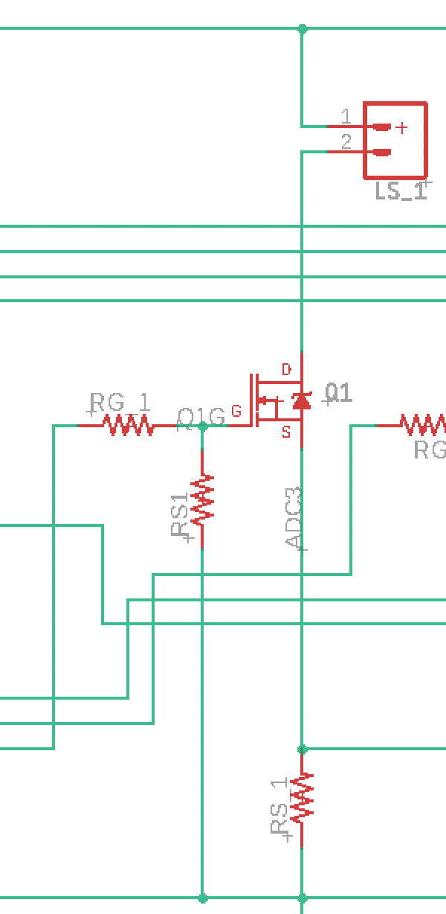
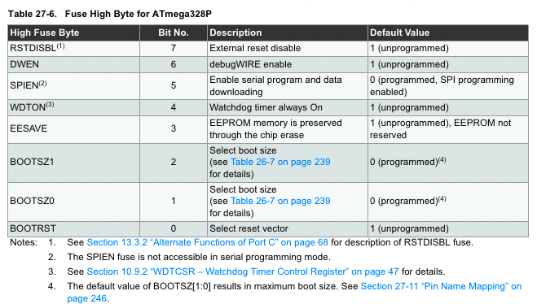
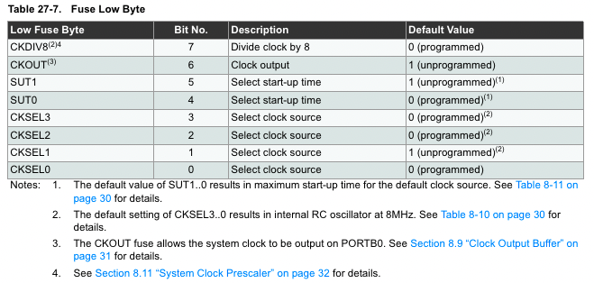

<!--- Press cmd+shift+v to preview --->

# Ironvan_Lights_v020 

## Development Notes

#### TABLE OF CONTENTS

**1. General Theory**
**2. Fuse Settings**
**3. I2C Bus Communication**
**4. ADC Processing**
**5. Watchdog Protection**
___

**1. General Theory**

*Processing Loop*

The lighting device will likely slow down the bus to some degree. Testing will be required to determine if the delays are acceptable. The processing loop occurs as follows:

`Setup` -> `Await control center check-in` -> `Respond to check-in` -> `First conversion (ADC0) begins` -|

`ADC ISR` <--> `I2C ISR`

The ISRs should execute in the order of occurance. Except for every `ADC_SAMPLES` interval (the number of samples between the `average` - `set` - `sequence` routine), the ADC interrupts will occur about every 208us and last only a few microseconds. Contrarily, the I2C interrupt will occur at irregular intervals and will be expected to wait until the ADC interrupt processing completes, if required.

*Light feedback structure*

Figure 1: A single light channel on PCB v1.0.

The light feedback structure is based on the schematic in Figure 1. Resistor, RS_1, is a 0.33 ohm, +/- 5% tolerance, 5W ceramic resistor. ADCs 0-3 will be used to read each of the light channels. Given an AREF of 3.3V, the following table shows a breakdown of the 10-bit ADC readout:

|ADC Readout|Voltage Drop|Minimum Current (+5%)|Nominal Current|Maximum Current (-5%)|
|---|---|---|---|---|
|0   |0.000000|0.000000|0.000000|0.000000 |
|1   |0.003223|0.009301|0.009766|0.010280 |
|2   |0.006445|0.018601|0.019531|0.020559 |
|3   |0.009668|0.027902|0.029297|0.030839 |
|4   |0.012891|0.037202|0.039063|0.041118 |
|5   |0.016113|0.046503|0.048828|0.051398 |
|6   |0.019336|0.055804|0.058594|0.061678 |
|7   |0.022559|0.065104|0.068359|0.071957 |
|8   |0.025781|0.074405|0.078125|0.082237 |
|9   |0.029004|0.083705|0.087891|0.092516 |
|10  |0.032227|0.093006|0.097656|0.102796 |
|11  |0.035449|0.102307|0.107422|0.113076 |
|12  |0.038672|0.111607|0.117188|0.123355 |
|13  |0.041895|0.120908|0.126953|0.133635 |
|14  |0.045117|0.130208|0.136719|0.143914 |
|15  |0.048340|0.139509|0.146484|0.154194 |
|16  |0.051563|0.148810|0.156250|0.164474 |
|17  |0.054785|0.158110|0.166016|0.174753 |
|18  |0.058008|0.167411|0.175781|0.185033 |
|19  |0.061230|0.176711|0.185547|0.195313 |
|20  |0.064453|0.186012|0.195313|0.205592 |
|21  |0.067676|0.195313|0.205078|0.215872 |
|22  |0.070898|0.204613|0.214844|0.226151 |
|23  |0.074121|0.213914|0.224609|0.236431 |
|24  |0.077344|0.223214|0.234375|0.246711 |
|25  |0.080566|0.232515|0.244141|0.256990 |
|26  |0.083789|0.241815|0.253906|0.267270 |
|27  |0.087012|0.251116|0.263672|0.277549 |
|28  |0.090234|0.260417|0.273438|0.287829 |
|29  |0.093457|0.269717|0.283203|0.298109 |
|30  |0.096680|0.279018|0.292969|0.308388 |
|31  |0.099902|0.288318|0.302734|0.318668 |
|32  |0.103125|0.297619|0.312500|0.328947 |
|33  |0.106348|0.306920|0.322266|0.339227 |
|34  |0.109570|0.316220|0.332031|0.349507 |
|35  |0.112793|0.325521|0.341797|0.359786 |
|36  |0.116016|0.334821|0.351563|0.370066 |
|37  |0.119238|0.344122|0.361328|0.380345 |
|38  |0.122461|0.353423|0.371094|0.390625 |
|39  |0.125684|0.362723|0.380859|0.400905 |
|40  |0.128906|0.372024|0.390625|0.411184 |
|41  |0.132129|0.381324|0.400391|0.421464 |
|42  |0.135352|0.390625|0.410156|0.431743 |
|43  |0.138574|0.399926|0.419922|0.442023 |
|44  |0.141797|0.409226|0.429688|0.452303 |
|45  |0.145020|0.418527|0.439453|0.462582 |
|46  |0.148242|0.427827|0.449219|0.472862 |
|47  |0.151465|0.437128|0.458984|0.483141 |
|48  |0.154688|0.446429|0.468750|0.493421 |
|49  |0.157910|0.455729|0.478516|0.503701 |
|50  |0.161133|0.465030|0.488281|0.513980 |
|51  |0.164355|0.474330|0.498047|0.524260 |
|52  |0.167578|0.483631|0.507813|0.534539 |
|53  |0.170801|0.492932|0.517578|0.544819 |
|54  |0.174023|0.502232|0.527344|0.555099 |
|55  |0.177246|0.511533|0.537109|0.565378 |
|56  |0.180469|0.520833|0.546875|0.575658 |
|57  |0.183691|0.530134|0.556641|0.585938 |
|58  |0.186914|0.539435|0.566406|0.596217 |
|59  |0.190137|0.548735|0.576172|0.606497 |
|60  |0.193359|0.558036|0.585938|0.616776 |
|61  |0.196582|0.567336|0.595703|0.627056 |
|62  |0.199805|0.576637|0.605469|0.637336 |
|63  |0.203027|0.585938|0.615234|0.647615 |
|64  |0.206250|0.595238|0.625000|0.657895 |
|65  |0.209473|0.604539|0.634766|0.668174 |
|66  |0.212695|0.613839|0.644531|0.678454 |
|67  |0.215918|0.623140|0.654297|0.688734 |
|68  |0.219141|0.632440|0.664063|0.699013 |
|69  |0.222363|0.641741|0.673828|0.709293 |
|70  |0.225586|0.651042|0.683594|0.719572 |
|71  |0.228809|0.660342|0.693359|0.729852 |
|72  |0.232031|0.669643|0.703125|0.740132 |
|73  |0.235254|0.678943|0.712891|0.750411 |
|74  |0.238477|0.688244|0.722656|0.760691 |
|75  |0.241699|0.697545|0.732422|0.770970 |
|76  |0.244922|0.706845|0.742188|0.781250 |
|77  |0.248145|0.716146|0.751953|0.791530 |
|78  |0.251367|0.725446|0.761719|0.801809 |
|79  |0.254590|0.734747|0.771484|0.812089 |
|80  |0.257813|0.744048|0.781250|0.822368 |
|81  |0.261035|0.753348|0.791016|0.832648 |
|82  |0.264258|0.762649|0.800781|0.842928 |
|83  |0.267480|0.771949|0.810547|0.853207 |
|84  |0.270703|0.781250|0.820313|0.863487 |
|85  |0.273926|0.790551|0.830078|0.873766 |
|86  |0.277148|0.799851|0.839844|0.884046 |
|87  |0.280371|0.809152|0.849609|0.894326 |
|88  |0.283594|0.818452|0.859375|0.904605 |
|89  |0.286816|0.827753|0.869141|0.914885 |
|90  |0.290039|0.837054|0.878906|0.925164 |
|91  |0.293262|0.846354|0.888672|0.935444 |
|92  |0.296484|0.855655|0.898438|0.945724 |
|93  |0.299707|0.864955|0.908203|0.956003 |
|94  |0.302930|0.874256|0.917969|0.966283 |
|95  |0.306152|0.883557|0.927734|0.976563 |
|96  |0.309375|0.892857|0.937500|0.986842 |
|97  |0.312598|0.902158|0.947266|0.997122 |
|98  |0.315820|0.911458|0.957031|1.007401 |
|99  |0.319043|0.920759|0.966797|1.017681 |
|100 |0.322266|0.930060|0.976563|1.027961 |
|101 |0.325488|0.939360|0.986328|1.038240 |
|102 |0.328711|0.948661|0.996094|1.048520 |
|103 |0.331934|0.957961|1.005859|1.058799 |
|104 |0.335156|0.967262|1.015625|1.069079 |
|105 |0.338379|0.976563|1.025391|1.079359 |
|106 |0.341602|0.985863|1.035156|1.089638 |
|107 |0.344824|0.995164|1.044922|1.099918 |
|108 |0.348047|1.004464|1.054688|1.110197 |
|109 |0.351270|1.013765|1.064453|1.120477 |
|110 |0.354492|1.023065|1.074219|1.130757 |
|111 |0.357715|1.032366|1.083984|1.141036 |
|112 |0.360938|1.041667|1.093750|1.151316 |
|113 |0.364160|1.050967|1.103516|1.161595 |
|114 |0.367383|1.060268|1.113281|1.171875 |
|115 |0.370605|1.069568|1.123047|1.182155 |
|116 |0.373828|1.078869|1.132813|1.192434 |
|117 |0.377051|1.088170|1.142578|1.202714 |
|118 |0.380273|1.097470|1.152344|1.212993 |
|119 |0.383496|1.106771|1.162109|1.223273 |
|120 |0.386719|1.116071|1.171875|1.233553 |
|121 |0.389941|1.125372|1.181641|1.243832 |
|122 |0.393164|1.134673|1.191406|1.254112 |
|123 |0.396387|1.143973|1.201172|1.264391 |
|124 |0.399609|1.153274|1.210938|1.274671 |
|125 |0.402832|1.162574|1.220703|1.284951 |
|126 |0.406055|1.171875|1.230469|1.295230 |
|127 |0.409277|1.181176|1.240234|1.305510 |
|128 |0.412500|1.190476|1.250000|1.315789 |
|129 |0.415723|1.199777|1.259766|1.326069 |
|130 |0.418945|1.209077|1.269531|1.336349 |
|131 |0.422168|1.218378|1.279297|1.346628 |
|132 |0.425391|1.227679|1.289063|1.356908 |
|133 |0.428613|1.236979|1.298828|1.367188 |
|134 |0.431836|1.246280|1.308594|1.377467 |
|135 |0.435059|1.255580|1.318359|1.387747 |
|136 |0.438281|1.264881|1.328125|1.398026 |
|137 |0.441504|1.274182|1.337891|1.408306 |
|138 |0.444727|1.283482|1.347656|1.418586 |
|139 |0.447949|1.292783|1.357422|1.428865 |
|140 |0.451172|1.302083|1.367188|1.439145 |
|141 |0.454395|1.311384|1.376953|1.449424 |
|142 |0.457617|1.320685|1.386719|1.459704 |
|143 |0.460840|1.329985|1.396484|1.469984 |
|144 |0.464063|1.339286|1.406250|1.480263 |
|145 |0.467285|1.348586|1.416016|1.490543 |
|146 |0.470508|1.357887|1.425781|1.500822 |
|147 |0.473730|1.367188|1.435547|1.511102 |
|148 |0.476953|1.376488|1.445313|1.521382 |
|149 |0.480176|1.385789|1.455078|1.531661 |
|150 |0.483398|1.395089|1.464844|1.541941 |
|151 |0.486621|1.404390|1.474609|1.552220 |
|152 |0.489844|1.413690|1.484375|1.562500 |
|153 |0.493066|1.422991|1.494141|1.572780 |
|154 |0.496289|1.432292|1.503906|1.583059 |
|155 |0.499512|1.441592|1.513672|1.593339 |
|156 |0.502734|1.450893|1.523438|1.603618 |
|157 |0.505957|1.460193|1.533203|1.613898 |
|158 |0.509180|1.469494|1.542969|1.624178 |
|159 |0.512402|1.478795|1.552734|1.634457 |
|160 |0.515625|1.488095|1.562500|1.644737 |
|161 |0.518848|1.497396|1.572266|1.655016 |
|162 |0.522070|1.506696|1.582031|1.665296 |
|163 |0.525293|1.515997|1.591797|1.675576 |
|164 |0.528516|1.525298|1.601563|1.685855 |
|165 |0.531738|1.534598|1.611328|1.696135 |
|166 |0.534961|1.543899|1.621094|1.706414 |
|167 |0.538184|1.553199|1.630859|1.716694 |
|168 |0.541406|1.562500|1.640625|1.726974 |
|169 |0.544629|1.571801|1.650391|1.737253 |
|170 |0.547852|1.581101|1.660156|1.747533 |
|171 |0.551074|1.590402|1.669922|1.757813 |
|172 |0.554297|1.599702|1.679688|1.768092 |
|173 |0.557520|1.609003|1.689453|1.778372 |
|174 |0.560742|1.618304|1.699219|1.788651 |
|175 |0.563965|1.627604|1.708984|1.798931 |
|176 |0.567188|1.636905|1.718750|1.809211 |
|177 |0.570410|1.646205|1.728516|1.819490 |
|178 |0.573633|1.655506|1.738281|1.829770 |
|179 |0.576855|1.664807|1.748047|1.840049 |
|180 |0.580078|1.674107|1.757813|1.850329 |
|181 |0.583301|1.683408|1.767578|1.860609 |
|182 |0.586523|1.692708|1.777344|1.870888 |
|183 |0.589746|1.702009|1.787109|1.881168 |
|184 |0.592969|1.711310|1.796875|1.891447 |
|185 |0.596191|1.720610|1.806641|1.901727 |
|186 |0.599414|1.729911|1.816406|1.912007 |
|187 |0.602637|1.739211|1.826172|1.922286 |
|188 |0.605859|1.748512|1.835938|1.932566 |
|189 |0.609082|1.757813|1.845703|1.942845 |
|190 |0.612305|1.767113|1.855469|1.953125 |
|191 |0.615527|1.776414|1.865234|1.963405 |
|192 |0.618750|1.785714|1.875000|1.973684 |
|193 |0.621973|1.795015|1.884766|1.983964 |
|194 |0.625195|1.804315|1.894531|1.994243 |
|195 |0.628418|1.813616|1.904297|2.004523 |
|196 |0.631641|1.822917|1.914063|2.014803 |
|197 |0.634863|1.832217|1.923828|2.025082 |
|198 |0.638086|1.841518|1.933594|2.035362 |
|199 |0.641309|1.850818|1.943359|2.045641 |
|200 |0.644531|1.860119|1.953125|2.055921 |
|201 |0.647754|1.869420|1.962891|2.066201 |
|202 |0.650977|1.878720|1.972656|2.076480 |
|203 |0.654199|1.888021|1.982422|2.086760 |
|204 |0.657422|1.897321|1.992188|2.097039 |
|205 |0.660645|1.906622|2.001953|2.107319 |
|206 |0.663867|1.915923|2.011719|2.117599 |
|207 |0.667090|1.925223|2.021484|2.127878 |
|208 |0.670313|1.934524|2.031250|2.138158 |
|209 |0.673535|1.943824|2.041016|2.148438 |
|210 |0.676758|1.953125|2.050781|2.158717 |
|211 |0.679980|1.962426|2.060547|2.168997 |
|212 |0.683203|1.971726|2.070313|2.179276 |
|213 |0.686426|1.981027|2.080078|2.189556 |
|214 |0.689648|1.990327|2.089844|2.199836 |
|215 |0.692871|1.999628|2.099609|2.210115 |
|216 |0.696094|2.008929|2.109375|2.220395 |
|217 |0.699316|2.018229|2.119141|2.230674 |
|218 |0.702539|2.027530|2.128906|2.240954 |
|219 |0.705762|2.036830|2.138672|2.251234 |
|220 |0.708984|2.046131|2.148438|2.261513 |
|221 |0.712207|2.055432|2.158203|2.271793 |
|222 |0.715430|2.064732|2.167969|2.282072 |
|223 |0.718652|2.074033|2.177734|2.292352 |
|224 |0.721875|2.083333|2.187500|2.302632 |
|225 |0.725098|2.092634|2.197266|2.312911 |
|226 |0.728320|2.101935|2.207031|2.323191 |
|227 |0.731543|2.111235|2.216797|2.333470 |
|228 |0.734766|2.120536|2.226563|2.343750 |
|229 |0.737988|2.129836|2.236328|2.354030 |
|230 |0.741211|2.139137|2.246094|2.364309 |
|231 |0.744434|2.148438|2.255859|2.374589 |
|232 |0.747656|2.157738|2.265625|2.384868 |
|233 |0.750879|2.167039|2.275391|2.395148 |
|234 |0.754102|2.176339|2.285156|2.405428 |
|235 |0.757324|2.185640|2.294922|2.415707 |
|236 |0.760547|2.194940|2.304688|2.425987 |
|237 |0.763770|2.204241|2.314453|2.436266 |
|238 |0.766992|2.213542|2.324219|2.446546 |
|239 |0.770215|2.222842|2.333984|2.456826 |
|240 |0.773438|2.232143|2.343750|2.467105 |
|241 |0.776660|2.241443|2.353516|2.477385 |
|242 |0.779883|2.250744|2.363281|2.487664 |
|243 |0.783105|2.260045|2.373047|2.497944 |
|244 |0.786328|2.269345|2.382813|2.508224 |
|245 |0.789551|2.278646|2.392578|2.518503 |
|246 |0.792773|2.287946|2.402344|2.528783 |
|247 |0.795996|2.297247|2.412109|2.539063 |
|248 |0.799219|2.306548|2.421875|2.549342 |
|249 |0.802441|2.315848|2.431641|2.559622 |
|250 |0.805664|2.325149|2.441406|2.569901 |
|251 |0.808887|2.334449|2.451172|2.580181 |
|252 |0.812109|2.343750|2.460938|2.590461 |
|253 |0.815332|2.353051|2.470703|2.600740 |
|254 |0.818555|2.362351|2.480469|2.611020 |
|255 |0.821777|2.371652|2.490234|2.621299 |
|256 |0.825000|2.380952|2.500000|2.631579 |
|257 |0.828223|2.390253|2.509766|2.641859 |
|258 |0.831445|2.399554|2.519531|2.652138 |
|259 |0.834668|2.408854|2.529297|2.662418 |
|260 |0.837891|2.418155|2.539063|2.672697 |
|261 |0.841113|2.427455|2.548828|2.682977 |
|262 |0.844336|2.436756|2.558594|2.693257 |
|263 |0.847559|2.446057|2.568359|2.703536 |
|264 |0.850781|2.455357|2.578125|2.713816 |
|265 |0.854004|2.464658|2.587891|2.724095 |
|266 |0.857227|2.473958|2.597656|2.734375 |
|267 |0.860449|2.483259|2.607422|2.744655 |
|268 |0.863672|2.492560|2.617188|2.754934 |
|269 |0.866895|2.501860|2.626953|2.765214 |
|270 |0.870117|2.511161|2.636719|2.775493 |
|271 |0.873340|2.520461|2.646484|2.785773 |
|272 |0.876563|2.529762|2.656250|2.796053 |
|273 |0.879785|2.539063|2.666016|2.806332 |
|274 |0.883008|2.548363|2.675781|2.816612 |
|275 |0.886230|2.557664|2.685547|2.826891 |
|276 |0.889453|2.566964|2.695313|2.837171 |
|277 |0.892676|2.576265|2.705078|2.847451 |
|278 |0.895898|2.585565|2.714844|2.857730 |
|279 |0.899121|2.594866|2.724609|2.868010 |
|280 |0.902344|2.604167|2.734375|2.878289 |
|281 |0.905566|2.613467|2.744141|2.888569 |
|282 |0.908789|2.622768|2.753906|2.898849 |
|283 |0.912012|2.632068|2.763672|2.909128 |
|284 |0.915234|2.641369|2.773438|2.919408 |
|285 |0.918457|2.650670|2.783203|2.929688 |
|286 |0.921680|2.659970|2.792969|2.939967 |
|287 |0.924902|2.669271|2.802734|2.950247 |
|288 |0.928125|2.678571|2.812500|2.960526 |
|289 |0.931348|2.687872|2.822266|2.970806 |
|290 |0.934570|2.697173|2.832031|2.981086 |
|291 |0.937793|2.706473|2.841797|2.991365 |
|292 |0.941016|2.715774|2.851563|3.001645 |
|293 |0.944238|2.725074|2.861328|3.011924 |
|294 |0.947461|2.734375|2.871094|3.022204 |
|295 |0.950684|2.743676|2.880859|3.032484 |
|296 |0.953906|2.752976|2.890625|3.042763 |
|297 |0.957129|2.762277|2.900391|3.053043 |
|298 |0.960352|2.771577|2.910156|3.063322 |
|299 |0.963574|2.780878|2.919922|3.073602 |
|300 |0.966797|2.790179|2.929688|3.083882 |
|301 |0.970020|2.799479|2.939453|3.094161 |
|302 |0.973242|2.808780|2.949219|3.104441 |
|303 |0.976465|2.818080|2.958984|3.114720 |
|304 |0.979688|2.827381|2.968750|3.125000 |
|305 |0.982910|2.836682|2.978516|3.135280 |
|306 |0.986133|2.845982|2.988281|3.145559 |
|307 |0.989355|2.855283|2.998047|3.155839 |
|308 |0.992578|2.864583|3.007813|3.166118 |
|309 |0.995801|2.873884|3.017578|3.176398 |
|310 |0.999023|2.883185|3.027344|3.186678 |
|311 |1.002246|2.892485|3.037109|3.196957 |
|312 |1.005469|2.901786|3.046875|3.207237 |
|313 |1.008691|2.911086|3.056641|3.217516 |
|314 |1.011914|2.920387|3.066406|3.227796 |
|315 |1.015137|2.929688|3.076172|3.238076 |
|316 |1.018359|2.938988|3.085938|3.248355 |
|317 |1.021582|2.948289|3.095703|3.258635 |
|318 |1.024805|2.957589|3.105469|3.268914 |
|319 |1.028027|2.966890|3.115234|3.279194 |
|320 |1.031250|2.976190|3.125000|3.289474 |
|321 |1.034473|2.985491|3.134766|3.299753 |
|322 |1.037695|2.994792|3.144531|3.310033 |
|323 |1.040918|3.004092|3.154297|3.320313 |
|324 |1.044141|3.013393|3.164063|3.330592 |
|325 |1.047363|3.022693|3.173828|3.340872 |
|326 |1.050586|3.031994|3.183594|3.351151 |
|327 |1.053809|3.041295|3.193359|3.361431 |
|328 |1.057031|3.050595|3.203125|3.371711 |
|329 |1.060254|3.059896|3.212891|3.381990 |
|330 |1.063477|3.069196|3.222656|3.392270 |
|331 |1.066699|3.078497|3.232422|3.402549 |
|332 |1.069922|3.087798|3.242188|3.412829 |
|333 |1.073145|3.097098|3.251953|3.423109 |
|334 |1.076367|3.106399|3.261719|3.433388 |
|335 |1.079590|3.115699|3.271484|3.443668 |
|336 |1.082813|3.125000|3.281250|3.453947 |
|337 |1.086035|3.134301|3.291016|3.464227 |
|338 |1.089258|3.143601|3.300781|3.474507 |
|339 |1.092480|3.152902|3.310547|3.484786 |
|340 |1.095703|3.162202|3.320313|3.495066 |
|341 |1.098926|3.171503|3.330078|3.505345 |
|342 |1.102148|3.180804|3.339844|3.515625 |
|343 |1.105371|3.190104|3.349609|3.525905 |
|344 |1.108594|3.199405|3.359375|3.536184 |
|345 |1.111816|3.208705|3.369141|3.546464 |
|346 |1.115039|3.218006|3.378906|3.556743 |
|347 |1.118262|3.227307|3.388672|3.567023 |
|348 |1.121484|3.236607|3.398438|3.577303 |
|349 |1.124707|3.245908|3.408203|3.587582 |
|350 |1.127930|3.255208|3.417969|3.597862 |
|351 |1.131152|3.264509|3.427734|3.608141 |
|352 |1.134375|3.273810|3.437500|3.618421 |
|353 |1.137598|3.283110|3.447266|3.628701 |
|354 |1.140820|3.292411|3.457031|3.638980 |
|355 |1.144043|3.301711|3.466797|3.649260 |
|356 |1.147266|3.311012|3.476563|3.659539 |
|357 |1.150488|3.320313|3.486328|3.669819 |
|358 |1.153711|3.329613|3.496094|3.680099 |
|359 |1.156934|3.338914|3.505859|3.690378 |
|360 |1.160156|3.348214|3.515625|3.700658 |
|361 |1.163379|3.357515|3.525391|3.710938 |
|362 |1.166602|3.366815|3.535156|3.721217 |
|363 |1.169824|3.376116|3.544922|3.731497 |
|364 |1.173047|3.385417|3.554688|3.741776 |
|365 |1.176270|3.394717|3.564453|3.752056 |
|366 |1.179492|3.404018|3.574219|3.762336 |
|367 |1.182715|3.413318|3.583984|3.772615 |
|368 |1.185938|3.422619|3.593750|3.782895 |
|369 |1.189160|3.431920|3.603516|3.793174 |
|370 |1.192383|3.441220|3.613281|3.803454 |
|371 |1.195605|3.450521|3.623047|3.813734 |
|372 |1.198828|3.459821|3.632813|3.824013 |
|373 |1.202051|3.469122|3.642578|3.834293 |
|374 |1.205273|3.478423|3.652344|3.844572 |
|375 |1.208496|3.487723|3.662109|3.854852 |
|376 |1.211719|3.497024|3.671875|3.865132 |
|377 |1.214941|3.506324|3.681641|3.875411 |
|378 |1.218164|3.515625|3.691406|3.885691 |
|379 |1.221387|3.524926|3.701172|3.895970 |
|380 |1.224609|3.534226|3.710938|3.906250 |
|381 |1.227832|3.543527|3.720703|3.916530 |
|382 |1.231055|3.552827|3.730469|3.926809 |
|383 |1.234277|3.562128|3.740234|3.937089 |
|384 |1.237500|3.571429|3.750000|3.947368 |
|385 |1.240723|3.580729|3.759766|3.957648 |
|386 |1.243945|3.590030|3.769531|3.967928 |
|387 |1.247168|3.599330|3.779297|3.978207 |
|388 |1.250391|3.608631|3.789063|3.988487 |
|389 |1.253613|3.617932|3.798828|3.998766 |
|390 |1.256836|3.627232|3.808594|4.009046 |
|391 |1.260059|3.636533|3.818359|4.019326 |
|392 |1.263281|3.645833|3.828125|4.029605 |
|393 |1.266504|3.655134|3.837891|4.039885 |
|394 |1.269727|3.664435|3.847656|4.050164 |
|395 |1.272949|3.673735|3.857422|4.060444 |
|396 |1.276172|3.683036|3.867188|4.070724 |
|397 |1.279395|3.692336|3.876953|4.081003 |
|398 |1.282617|3.701637|3.886719|4.091283 |
|399 |1.285840|3.710938|3.896484|4.101563 |
|400 |1.289063|3.720238|3.906250|4.111842 |
|401 |1.292285|3.729539|3.916016|4.122122 |
|402 |1.295508|3.738839|3.925781|4.132401 |
|403 |1.298730|3.748140|3.935547|4.142681 |
|404 |1.301953|3.757440|3.945313|4.152961 |
|405 |1.305176|3.766741|3.955078|4.163240 |
|406 |1.308398|3.776042|3.964844|4.173520 |
|407 |1.311621|3.785342|3.974609|4.183799 |
|408 |1.314844|3.794643|3.984375|4.194079 |
|409 |1.318066|3.803943|3.994141|4.204359 |
|410 |1.321289|3.813244|4.003906|4.214638 |
|411 |1.324512|3.822545|4.013672|4.224918 |
|412 |1.327734|3.831845|4.023438|4.235197 |
|413 |1.330957|3.841146|4.033203|4.245477 |
|414 |1.334180|3.850446|4.042969|4.255757 |
|415 |1.337402|3.859747|4.052734|4.266036 |
|416 |1.340625|3.869048|4.062500|4.276316 |
|417 |1.343848|3.878348|4.072266|4.286595 |
|418 |1.347070|3.887649|4.082031|4.296875 |
|419 |1.350293|3.896949|4.091797|4.307155 |
|420 |1.353516|3.906250|4.101563|4.317434 |
|421 |1.356738|3.915551|4.111328|4.327714 |
|422 |1.359961|3.924851|4.121094|4.337993 |
|423 |1.363184|3.934152|4.130859|4.348273 |
|424 |1.366406|3.943452|4.140625|4.358553 |
|425 |1.369629|3.952753|4.150391|4.368832 |
|426 |1.372852|3.962054|4.160156|4.379112 |
|427 |1.376074|3.971354|4.169922|4.389391 |
|428 |1.379297|3.980655|4.179688|4.399671 |
|429 |1.382520|3.989955|4.189453|4.409951 |
|430 |1.385742|3.999256|4.199219|4.420230 |
|431 |1.388965|4.008557|4.208984|4.430510 |
|432 |1.392188|4.017857|4.218750|4.440789 |
|433 |1.395410|4.027158|4.228516|4.451069 |
|434 |1.398633|4.036458|4.238281|4.461349 |
|435 |1.401855|4.045759|4.248047|4.471628 |
|436 |1.405078|4.055060|4.257813|4.481908 |
|437 |1.408301|4.064360|4.267578|4.492188 |
|438 |1.411523|4.073661|4.277344|4.502467 |
|439 |1.414746|4.082961|4.287109|4.512747 |
|440 |1.417969|4.092262|4.296875|4.523026 |
|441 |1.421191|4.101563|4.306641|4.533306 |
|442 |1.424414|4.110863|4.316406|4.543586 |
|443 |1.427637|4.120164|4.326172|4.553865 |
|444 |1.430859|4.129464|4.335938|4.564145 |
|445 |1.434082|4.138765|4.345703|4.574424 |
|446 |1.437305|4.148065|4.355469|4.584704 |
|447 |1.440527|4.157366|4.365234|4.594984 |
|448 |1.443750|4.166667|4.375000|4.605263 |
|449 |1.446973|4.175967|4.384766|4.615543 |
|450 |1.450195|4.185268|4.394531|4.625822 |
|451 |1.453418|4.194568|4.404297|4.636102 |
|452 |1.456641|4.203869|4.414063|4.646382 |
|453 |1.459863|4.213170|4.423828|4.656661 |
|454 |1.463086|4.222470|4.433594|4.666941 |
|455 |1.466309|4.231771|4.443359|4.677220 |
|456 |1.469531|4.241071|4.453125|4.687500 |
|457 |1.472754|4.250372|4.462891|4.697780 |
|458 |1.475977|4.259673|4.472656|4.708059 |
|459 |1.479199|4.268973|4.482422|4.718339 |
|460 |1.482422|4.278274|4.492188|4.728618 |
|461 |1.485645|4.287574|4.501953|4.738898 |
|462 |1.488867|4.296875|4.511719|4.749178 |
|463 |1.492090|4.306176|4.521484|4.759457 |
|464 |1.495313|4.315476|4.531250|4.769737 |
|465 |1.498535|4.324777|4.541016|4.780016 |
|466 |1.501758|4.334077|4.550781|4.790296 |
|467 |1.504980|4.343378|4.560547|4.800576 |
|468 |1.508203|4.352679|4.570313|4.810855 |
|469 |1.511426|4.361979|4.580078|4.821135 |
|470 |1.514648|4.371280|4.589844|4.831414 |
|471 |1.517871|4.380580|4.599609|4.841694 |
|472 |1.521094|4.389881|4.609375|4.851974 |
|473 |1.524316|4.399182|4.619141|4.862253 |
|474 |1.527539|4.408482|4.628906|4.872533 |
|475 |1.530762|4.417783|4.638672|4.882813 |
|476 |1.533984|4.427083|4.648438|4.893092 |
|477 |1.537207|4.436384|4.658203|4.903372 |
|478 |1.540430|4.445685|4.667969|4.913651 |
|479 |1.543652|4.454985|4.677734|4.923931 |
|480 |1.546875|4.464286|4.687500|4.934211 |
|481 |1.550098|4.473586|4.697266|4.944490 |
|482 |1.553320|4.482887|4.707031|4.954770 |
|483 |1.556543|4.492188|4.716797|4.965049 |
|484 |1.559766|4.501488|4.726563|4.975329 |
|485 |1.562988|4.510789|4.736328|4.985609 |
|486 |1.566211|4.520089|4.746094|4.995888 |
|487 |1.569434|4.529390|4.755859|5.006168 |
|488 |1.572656|4.538690|4.765625|5.016447 |
|489 |1.575879|4.547991|4.775391|5.026727 |
|490 |1.579102|4.557292|4.785156|5.037007 |
|491 |1.582324|4.566592|4.794922|5.047286 |
|492 |1.585547|4.575893|4.804688|5.057566 |
|493 |1.588770|4.585193|4.814453|5.067845 |
|494 |1.591992|4.594494|4.824219|5.078125 |
|495 |1.595215|4.603795|4.833984|5.088405 |
|496 |1.598438|4.613095|4.843750|5.098684 |
|497 |1.601660|4.622396|4.853516|5.108964 |
|498 |1.604883|4.631696|4.863281|5.119243 |
|499 |1.608105|4.640997|4.873047|5.129523 |
|500 |1.611328|4.650298|4.882813|5.139803 |
|501 |1.614551|4.659598|4.892578|5.150082 |
|502 |1.617773|4.668899|4.902344|5.160362 |
|503 |1.620996|4.678199|4.912109|5.170641 |
|504 |1.624219|4.687500|4.921875|5.180921 |
|505 |1.627441|4.696801|4.931641|5.191201 |
|506 |1.630664|4.706101|4.941406|5.201480 |
|507 |1.633887|4.715402|4.951172|5.211760 |
|508 |1.637109|4.724702|4.960938|5.222039 |
|509 |1.640332|4.734003|4.970703|5.232319 |
|510 |1.643555|4.743304|4.980469|5.242599 |
|511 |1.646777|4.752604|4.990234|5.252878 |
|512 |1.650000|4.761905|5.000000|5.263158 |
|513 |1.653223|4.771205|5.009766|5.273438 |
|514 |1.656445|4.780506|5.019531|5.283717 |
|515 |1.659668|4.789807|5.029297|5.293997 |
|516 |1.662891|4.799107|5.039063|5.304276 |
|517 |1.666113|4.808408|5.048828|5.314556 |
|518 |1.669336|4.817708|5.058594|5.324836 |
|519 |1.672559|4.827009|5.068359|5.335115 |
|520 |1.675781|4.836310|5.078125|5.345395 |
|521 |1.679004|4.845610|5.087891|5.355674 |
|522 |1.682227|4.854911|5.097656|5.365954 |
|523 |1.685449|4.864211|5.107422|5.376234 |
|524 |1.688672|4.873512|5.117188|5.386513 |
|525 |1.691895|4.882813|5.126953|5.396793 |
|526 |1.695117|4.892113|5.136719|5.407072 |
|527 |1.698340|4.901414|5.146484|5.417352 |
|528 |1.701563|4.910714|5.156250|5.427632 |
|529 |1.704785|4.920015|5.166016|5.437911 |
|530 |1.708008|4.929315|5.175781|5.448191 |
|531 |1.711230|4.938616|5.185547|5.458470 |
|532 |1.714453|4.947917|5.195313|5.468750 |
|533 |1.717676|4.957217|5.205078|5.479030 |
|534 |1.720898|4.966518|5.214844|5.489309 |
|535 |1.724121|4.975818|5.224609|5.499589 |
|536 |1.727344|4.985119|5.234375|5.509868 |
|537 |1.730566|4.994420|5.244141|5.520148 |
|538 |1.733789|5.003720|5.253906|5.530428 |
|539 |1.737012|5.013021|5.263672|5.540707 |
|540 |1.740234|5.022321|5.273438|5.550987 |
|541 |1.743457|5.031622|5.283203|5.561266 |
|542 |1.746680|5.040923|5.292969|5.571546 |
|543 |1.749902|5.050223|5.302734|5.581826 |
|544 |1.753125|5.059524|5.312500|5.592105 |
|545 |1.756348|5.068824|5.322266|5.602385 |
|546 |1.759570|5.078125|5.332031|5.612664 |
|547 |1.762793|5.087426|5.341797|5.622944 |
|548 |1.766016|5.096726|5.351563|5.633224 |
|549 |1.769238|5.106027|5.361328|5.643503 |
|550 |1.772461|5.115327|5.371094|5.653783 |
|551 |1.775684|5.124628|5.380859|5.664063 |
|552 |1.778906|5.133929|5.390625|5.674342 |
|553 |1.782129|5.143229|5.400391|5.684622 |
|554 |1.785352|5.152530|5.410156|5.694901 |
|555 |1.788574|5.161830|5.419922|5.705181 |
|556 |1.791797|5.171131|5.429688|5.715461 |
|557 |1.795020|5.180432|5.439453|5.725740 |
|558 |1.798242|5.189732|5.449219|5.736020 |
|559 |1.801465|5.199033|5.458984|5.746299 |
|560 |1.804688|5.208333|5.468750|5.756579 |
|561 |1.807910|5.217634|5.478516|5.766859 |
|562 |1.811133|5.226935|5.488281|5.777138 |
|563 |1.814355|5.236235|5.498047|5.787418 |
|564 |1.817578|5.245536|5.507813|5.797697 |
|565 |1.820801|5.254836|5.517578|5.807977 |
|566 |1.824023|5.264137|5.527344|5.818257 |
|567 |1.827246|5.273438|5.537109|5.828536 |
|568 |1.830469|5.282738|5.546875|5.838816 |
|569 |1.833691|5.292039|5.556641|5.849095 |
|570 |1.836914|5.301339|5.566406|5.859375 |
|571 |1.840137|5.310640|5.576172|5.869655 |
|572 |1.843359|5.319940|5.585938|5.879934 |
|573 |1.846582|5.329241|5.595703|5.890214 |
|574 |1.849805|5.338542|5.605469|5.900493 |
|575 |1.853027|5.347842|5.615234|5.910773 |
|576 |1.856250|5.357143|5.625000|5.921053 |
|577 |1.859473|5.366443|5.634766|5.931332 |
|578 |1.862695|5.375744|5.644531|5.941612 |
|579 |1.865918|5.385045|5.654297|5.951891 |
|580 |1.869141|5.394345|5.664063|5.962171 |
|581 |1.872363|5.403646|5.673828|5.972451 |
|582 |1.875586|5.412946|5.683594|5.982730 |
|583 |1.878809|5.422247|5.693359|5.993010 |
|584 |1.882031|5.431548|5.703125|6.003289 |
|585 |1.885254|5.440848|5.712891|6.013569 |
|586 |1.888477|5.450149|5.722656|6.023849 |
|587 |1.891699|5.459449|5.732422|6.034128 |
|588 |1.894922|5.468750|5.742188|6.044408 |
|589 |1.898145|5.478051|5.751953|6.054688 |
|590 |1.901367|5.487351|5.761719|6.064967 |
|591 |1.904590|5.496652|5.771484|6.075247 |
|592 |1.907813|5.505952|5.781250|6.085526 |
|593 |1.911035|5.515253|5.791016|6.095806 |
|594 |1.914258|5.524554|5.800781|6.106086 |
|595 |1.917480|5.533854|5.810547|6.116365 |
|596 |1.920703|5.543155|5.820313|6.126645 |
|597 |1.923926|5.552455|5.830078|6.136924 |
|598 |1.927148|5.561756|5.839844|6.147204 |
|599 |1.930371|5.571057|5.849609|6.157484 |
|600 |1.933594|5.580357|5.859375|6.167763 |
|601 |1.936816|5.589658|5.869141|6.178043 |
|602 |1.940039|5.598958|5.878906|6.188322 |
|603 |1.943262|5.608259|5.888672|6.198602 |
|604 |1.946484|5.617560|5.898438|6.208882 |
|605 |1.949707|5.626860|5.908203|6.219161 |
|606 |1.952930|5.636161|5.917969|6.229441 |
|607 |1.956152|5.645461|5.927734|6.239720 |
|608 |1.959375|5.654762|5.937500|6.250000 |
|609 |1.962598|5.664063|5.947266|6.260280 |
|610 |1.965820|5.673363|5.957031|6.270559 |
|611 |1.969043|5.682664|5.966797|6.280839 |
|612 |1.972266|5.691964|5.976563|6.291118 |
|613 |1.975488|5.701265|5.986328|6.301398 |
|614 |1.978711|5.710565|5.996094|6.311678 |
|615 |1.981934|5.719866|6.005859|6.321957 |
|616 |1.985156|5.729167|6.015625|6.332237 |
|617 |1.988379|5.738467|6.025391|6.342516 |
|618 |1.991602|5.747768|6.035156|6.352796 |
|619 |1.994824|5.757068|6.044922|6.363076 |
|620 |1.998047|5.766369|6.054688|6.373355 |
|621 |2.001270|5.775670|6.064453|6.383635 |
|622 |2.004492|5.784970|6.074219|6.393914 |
|623 |2.007715|5.794271|6.083984|6.404194 |
|624 |2.010938|5.803571|6.093750|6.414474 |
|625 |2.014160|5.812872|6.103516|6.424753 |
|626 |2.017383|5.822173|6.113281|6.435033 |
|627 |2.020605|5.831473|6.123047|6.445313 |
|628 |2.023828|5.840774|6.132813|6.455592 |
|629 |2.027051|5.850074|6.142578|6.465872 |
|630 |2.030273|5.859375|6.152344|6.476151 |
|631 |2.033496|5.868676|6.162109|6.486431 |
|632 |2.036719|5.877976|6.171875|6.496711 |
|633 |2.039941|5.887277|6.181641|6.506990 |
|634 |2.043164|5.896577|6.191406|6.517270 |
|635 |2.046387|5.905878|6.201172|6.527549 |
|636 |2.049609|5.915179|6.210938|6.537829 |
|637 |2.052832|5.924479|6.220703|6.548109 |
|638 |2.056055|5.933780|6.230469|6.558388 |
|639 |2.059277|5.943080|6.240234|6.568668 |
|640 |2.062500|5.952381|6.250000|6.578947 |
|641 |2.065723|5.961682|6.259766|6.589227 |
|642 |2.068945|5.970982|6.269531|6.599507 |
|643 |2.072168|5.980283|6.279297|6.609786 |
|644 |2.075391|5.989583|6.289063|6.620066 |
|645 |2.078613|5.998884|6.298828|6.630345 |
|646 |2.081836|6.008185|6.308594|6.640625 |
|647 |2.085059|6.017485|6.318359|6.650905 |
|648 |2.088281|6.026786|6.328125|6.661184 |
|649 |2.091504|6.036086|6.337891|6.671464 |
|650 |2.094727|6.045387|6.347656|6.681743 |
|651 |2.097949|6.054688|6.357422|6.692023 |
|652 |2.101172|6.063988|6.367188|6.702303 |
|653 |2.104395|6.073289|6.376953|6.712582 |
|654 |2.107617|6.082589|6.386719|6.722862 |
|655 |2.110840|6.091890|6.396484|6.733141 |
|656 |2.114063|6.101190|6.406250|6.743421 |
|657 |2.117285|6.110491|6.416016|6.753701 |
|658 |2.120508|6.119792|6.425781|6.763980 |
|659 |2.123730|6.129092|6.435547|6.774260 |
|660 |2.126953|6.138393|6.445313|6.784539 |
|661 |2.130176|6.147693|6.455078|6.794819 |
|662 |2.133398|6.156994|6.464844|6.805099 |
|663 |2.136621|6.166295|6.474609|6.815378 |
|664 |2.139844|6.175595|6.484375|6.825658 |
|665 |2.143066|6.184896|6.494141|6.835938 |
|666 |2.146289|6.194196|6.503906|6.846217 |
|667 |2.149512|6.203497|6.513672|6.856497 |
|668 |2.152734|6.212798|6.523438|6.866776 |
|669 |2.155957|6.222098|6.533203|6.877056 |
|670 |2.159180|6.231399|6.542969|6.887336 |
|671 |2.162402|6.240699|6.552734|6.897615 |
|672 |2.165625|6.250000|6.562500|6.907895 |
|673 |2.168848|6.259301|6.572266|6.918174 |
|674 |2.172070|6.268601|6.582031|6.928454 |
|675 |2.175293|6.277902|6.591797|6.938734 |
|676 |2.178516|6.287202|6.601563|6.949013 |
|677 |2.181738|6.296503|6.611328|6.959293 |
|678 |2.184961|6.305804|6.621094|6.969572 |
|679 |2.188184|6.315104|6.630859|6.979852 |
|680 |2.191406|6.324405|6.640625|6.990132 |
|681 |2.194629|6.333705|6.650391|7.000411 |
|682 |2.197852|6.343006|6.660156|7.010691 |
|683 |2.201074|6.352307|6.669922|7.020970 |
|684 |2.204297|6.361607|6.679688|7.031250 |
|685 |2.207520|6.370908|6.689453|7.041530 |
|686 |2.210742|6.380208|6.699219|7.051809 |
|687 |2.213965|6.389509|6.708984|7.062089 |
|688 |2.217188|6.398810|6.718750|7.072368 |
|689 |2.220410|6.408110|6.728516|7.082648 |
|690 |2.223633|6.417411|6.738281|7.092928 |
|691 |2.226855|6.426711|6.748047|7.103207 |
|692 |2.230078|6.436012|6.757813|7.113487 |
|693 |2.233301|6.445313|6.767578|7.123766 |
|694 |2.236523|6.454613|6.777344|7.134046 |
|695 |2.239746|6.463914|6.787109|7.144326 |
|696 |2.242969|6.473214|6.796875|7.154605 |
|697 |2.246191|6.482515|6.806641|7.164885 |
|698 |2.249414|6.491815|6.816406|7.175164 |
|699 |2.252637|6.501116|6.826172|7.185444 |
|700 |2.255859|6.510417|6.835938|7.195724 |
|701 |2.259082|6.519717|6.845703|7.206003 |
|702 |2.262305|6.529018|6.855469|7.216283 |
|703 |2.265527|6.538318|6.865234|7.226563 |
|704 |2.268750|6.547619|6.875000|7.236842 |
|705 |2.271973|6.556920|6.884766|7.247122 |
|706 |2.275195|6.566220|6.894531|7.257401 |
|707 |2.278418|6.575521|6.904297|7.267681 |
|708 |2.281641|6.584821|6.914063|7.277961 |
|709 |2.284863|6.594122|6.923828|7.288240 |
|710 |2.288086|6.603423|6.933594|7.298520 |
|711 |2.291309|6.612723|6.943359|7.308799 |
|712 |2.294531|6.622024|6.953125|7.319079 |
|713 |2.297754|6.631324|6.962891|7.329359 |
|714 |2.300977|6.640625|6.972656|7.339638 |
|715 |2.304199|6.649926|6.982422|7.349918 |
|716 |2.307422|6.659226|6.992188|7.360197 |
|717 |2.310645|6.668527|7.001953|7.370477 |
|718 |2.313867|6.677827|7.011719|7.380757 |
|719 |2.317090|6.687128|7.021484|7.391036 |
|720 |2.320313|6.696429|7.031250|7.401316 |
|721 |2.323535|6.705729|7.041016|7.411595 |
|722 |2.326758|6.715030|7.050781|7.421875 |
|723 |2.329980|6.724330|7.060547|7.432155 |
|724 |2.333203|6.733631|7.070313|7.442434 |
|725 |2.336426|6.742932|7.080078|7.452714 |
|726 |2.339648|6.752232|7.089844|7.462993 |
|727 |2.342871|6.761533|7.099609|7.473273 |
|728 |2.346094|6.770833|7.109375|7.483553 |
|729 |2.349316|6.780134|7.119141|7.493832 |
|730 |2.352539|6.789435|7.128906|7.504112 |
|731 |2.355762|6.798735|7.138672|7.514391 |
|732 |2.358984|6.808036|7.148438|7.524671 |
|733 |2.362207|6.817336|7.158203|7.534951 |
|734 |2.365430|6.826637|7.167969|7.545230 |
|735 |2.368652|6.835938|7.177734|7.555510 |
|736 |2.371875|6.845238|7.187500|7.565789 |
|737 |2.375098|6.854539|7.197266|7.576069 |
|738 |2.378320|6.863839|7.207031|7.586349 |
|739 |2.381543|6.873140|7.216797|7.596628 |
|740 |2.384766|6.882440|7.226563|7.606908 |
|741 |2.387988|6.891741|7.236328|7.617188 |
|742 |2.391211|6.901042|7.246094|7.627467 |
|743 |2.394434|6.910342|7.255859|7.637747 |
|744 |2.397656|6.919643|7.265625|7.648026 |
|745 |2.400879|6.928943|7.275391|7.658306 |
|746 |2.404102|6.938244|7.285156|7.668586 |
|747 |2.407324|6.947545|7.294922|7.678865 |
|748 |2.410547|6.956845|7.304688|7.689145 |
|749 |2.413770|6.966146|7.314453|7.699424 |
|750 |2.416992|6.975446|7.324219|7.709704 |
|751 |2.420215|6.984747|7.333984|7.719984 |
|752 |2.423438|6.994048|7.343750|7.730263 |
|753 |2.426660|7.003348|7.353516|7.740543 |
|754 |2.429883|7.012649|7.363281|7.750822 |
|755 |2.433105|7.021949|7.373047|7.761102 |
|756 |2.436328|7.031250|7.382813|7.771382 |
|757 |2.439551|7.040551|7.392578|7.781661 |
|758 |2.442773|7.049851|7.402344|7.791941 |
|759 |2.445996|7.059152|7.412109|7.802220 |
|760 |2.449219|7.068452|7.421875|7.812500 |
|761 |2.452441|7.077753|7.431641|7.822780 |
|762 |2.455664|7.087054|7.441406|7.833059 |
|763 |2.458887|7.096354|7.451172|7.843339 |
|764 |2.462109|7.105655|7.460938|7.853618 |
|765 |2.465332|7.114955|7.470703|7.863898 |
|766 |2.468555|7.124256|7.480469|7.874178 |
|767 |2.471777|7.133557|7.490234|7.884457 |
|768 |2.475000|7.142857|7.500000|7.894737 |
|769 |2.478223|7.152158|7.509766|7.905016 |
|770 |2.481445|7.161458|7.519531|7.915296 |
|771 |2.484668|7.170759|7.529297|7.925576 |
|772 |2.487891|7.180060|7.539063|7.935855 |
|773 |2.491113|7.189360|7.548828|7.946135 |
|774 |2.494336|7.198661|7.558594|7.956414 |
|775 |2.497559|7.207961|7.568359|7.966694 |
|776 |2.500781|7.217262|7.578125|7.976974 |
|777 |2.504004|7.226563|7.587891|7.987253 |
|778 |2.507227|7.235863|7.597656|7.997533 |
|779 |2.510449|7.245164|7.607422|8.007813 |
|780 |2.513672|7.254464|7.617188|8.018092 |
|781 |2.516895|7.263765|7.626953|8.028372 |
|782 |2.520117|7.273065|7.636719|8.038651 |
|783 |2.523340|7.282366|7.646484|8.048931 |
|784 |2.526563|7.291667|7.656250|8.059211 |
|785 |2.529785|7.300967|7.666016|8.069490 |
|786 |2.533008|7.310268|7.675781|8.079770 |
|787 |2.536230|7.319568|7.685547|8.090049 |
|788 |2.539453|7.328869|7.695313|8.100329 |
|789 |2.542676|7.338170|7.705078|8.110609 |
|790 |2.545898|7.347470|7.714844|8.120888 |
|791 |2.549121|7.356771|7.724609|8.131168 |
|792 |2.552344|7.366071|7.734375|8.141447 |
|793 |2.555566|7.375372|7.744141|8.151727 |
|794 |2.558789|7.384673|7.753906|8.162007 |
|795 |2.562012|7.393973|7.763672|8.172286 |
|796 |2.565234|7.403274|7.773438|8.182566 |
|797 |2.568457|7.412574|7.783203|8.192845 |
|798 |2.571680|7.421875|7.792969|8.203125 |
|799 |2.574902|7.431176|7.802734|8.213405 |
|800 |2.578125|7.440476|7.812500|8.223684 |
|801 |2.581348|7.449777|7.822266|8.233964 |
|802 |2.584570|7.459077|7.832031|8.244243 |
|803 |2.587793|7.468378|7.841797|8.254523 |
|804 |2.591016|7.477679|7.851563|8.264803 |
|805 |2.594238|7.486979|7.861328|8.275082 |
|806 |2.597461|7.496280|7.871094|8.285362 |
|807 |2.600684|7.505580|7.880859|8.295641 |
|808 |2.603906|7.514881|7.890625|8.305921 |
|809 |2.607129|7.524182|7.900391|8.316201 |
|810 |2.610352|7.533482|7.910156|8.326480 |
|811 |2.613574|7.542783|7.919922|8.336760 |
|812 |2.616797|7.552083|7.929688|8.347039 |
|813 |2.620020|7.561384|7.939453|8.357319 |
|814 |2.623242|7.570685|7.949219|8.367599 |
|815 |2.626465|7.579985|7.958984|8.377878 |
|816 |2.629688|7.589286|7.968750|8.388158 |
|817 |2.632910|7.598586|7.978516|8.398438 |
|818 |2.636133|7.607887|7.988281|8.408717 |
|819 |2.639355|7.617188|7.998047|8.418997 |
|820 |2.642578|7.626488|8.007813|8.429276 |
|821 |2.645801|7.635789|8.017578|8.439556 |
|822 |2.649023|7.645089|8.027344|8.449836 |
|823 |2.652246|7.654390|8.037109|8.460115 |
|824 |2.655469|7.663690|8.046875|8.470395 |
|825 |2.658691|7.672991|8.056641|8.480674 |
|826 |2.661914|7.682292|8.066406|8.490954 |
|827 |2.665137|7.691592|8.076172|8.501234 |
|828 |2.668359|7.700893|8.085938|8.511513 |
|829 |2.671582|7.710193|8.095703|8.521793 |
|830 |2.674805|7.719494|8.105469|8.532072 |
|831 |2.678027|7.728795|8.115234|8.542352 |
|832 |2.681250|7.738095|8.125000|8.552632 |
|833 |2.684473|7.747396|8.134766|8.562911 |
|834 |2.687695|7.756696|8.144531|8.573191 |
|835 |2.690918|7.765997|8.154297|8.583470 |
|836 |2.694141|7.775298|8.164063|8.593750 |
|837 |2.697363|7.784598|8.173828|8.604030 |
|838 |2.700586|7.793899|8.183594|8.614309 |
|839 |2.703809|7.803199|8.193359|8.624589 |
|840 |2.707031|7.812500|8.203125|8.634868 |
|841 |2.710254|7.821801|8.212891|8.645148 |
|842 |2.713477|7.831101|8.222656|8.655428 |
|843 |2.716699|7.840402|8.232422|8.665707 |
|844 |2.719922|7.849702|8.242188|8.675987 |
|845 |2.723145|7.859003|8.251953|8.686266 |
|846 |2.726367|7.868304|8.261719|8.696546 |
|847 |2.729590|7.877604|8.271484|8.706826 |
|848 |2.732813|7.886905|8.281250|8.717105 |
|849 |2.736035|7.896205|8.291016|8.727385 |
|850 |2.739258|7.905506|8.300781|8.737664 |
|851 |2.742480|7.914807|8.310547|8.747944 |
|852 |2.745703|7.924107|8.320313|8.758224 |
|853 |2.748926|7.933408|8.330078|8.768503 |
|854 |2.752148|7.942708|8.339844|8.778783 |
|855 |2.755371|7.952009|8.349609|8.789063 |
|856 |2.758594|7.961310|8.359375|8.799342 |
|857 |2.761816|7.970610|8.369141|8.809622 |
|858 |2.765039|7.979911|8.378906|8.819901 |
|859 |2.768262|7.989211|8.388672|8.830181 |
|860 |2.771484|7.998512|8.398438|8.840461 |
|861 |2.774707|8.007813|8.408203|8.850740 |
|862 |2.777930|8.017113|8.417969|8.861020 |
|863 |2.781152|8.026414|8.427734|8.871299 |
|864 |2.784375|8.035714|8.437500|8.881579 |
|865 |2.787598|8.045015|8.447266|8.891859 |
|866 |2.790820|8.054315|8.457031|8.902138 |
|867 |2.794043|8.063616|8.466797|8.912418 |
|868 |2.797266|8.072917|8.476563|8.922697 |
|869 |2.800488|8.082217|8.486328|8.932977 |
|870 |2.803711|8.091518|8.496094|8.943257 |
|871 |2.806934|8.100818|8.505859|8.953536 |
|872 |2.810156|8.110119|8.515625|8.963816 |
|873 |2.813379|8.119420|8.525391|8.974095 |
|874 |2.816602|8.128720|8.535156|8.984375 |
|875 |2.819824|8.138021|8.544922|8.994655 |
|876 |2.823047|8.147321|8.554688|9.004934 |
|877 |2.826270|8.156622|8.564453|9.015214 |
|878 |2.829492|8.165923|8.574219|9.025493 |
|879 |2.832715|8.175223|8.583984|9.035773 |
|880 |2.835938|8.184524|8.593750|9.046053 |
|881 |2.839160|8.193824|8.603516|9.056332 |
|882 |2.842383|8.203125|8.613281|9.066612 |
|883 |2.845605|8.212426|8.623047|9.076891 |
|884 |2.848828|8.221726|8.632813|9.087171 |
|885 |2.852051|8.231027|8.642578|9.097451 |
|886 |2.855273|8.240327|8.652344|9.107730 |
|887 |2.858496|8.249628|8.662109|9.118010 |
|888 |2.861719|8.258929|8.671875|9.128289 |
|889 |2.864941|8.268229|8.681641|9.138569 |
|890 |2.868164|8.277530|8.691406|9.148849 |
|891 |2.871387|8.286830|8.701172|9.159128 |
|892 |2.874609|8.296131|8.710938|9.169408 |
|893 |2.877832|8.305432|8.720703|9.179688 |
|894 |2.881055|8.314732|8.730469|9.189967 |
|895 |2.884277|8.324033|8.740234|9.200247 |
|896 |2.887500|8.333333|8.750000|9.210526 |
|897 |2.890723|8.342634|8.759766|9.220806 |
|898 |2.893945|8.351935|8.769531|9.231086 |
|899 |2.897168|8.361235|8.779297|9.241365 |
|900 |2.900391|8.370536|8.789063|9.251645 |
|901 |2.903613|8.379836|8.798828|9.261924 |
|902 |2.906836|8.389137|8.808594|9.272204 |
|903 |2.910059|8.398438|8.818359|9.282484 |
|904 |2.913281|8.407738|8.828125|9.292763 |
|905 |2.916504|8.417039|8.837891|9.303043 |
|906 |2.919727|8.426339|8.847656|9.313322 |
|907 |2.922949|8.435640|8.857422|9.323602 |
|908 |2.926172|8.444940|8.867188|9.333882 |
|909 |2.929395|8.454241|8.876953|9.344161 |
|910 |2.932617|8.463542|8.886719|9.354441 |
|911 |2.935840|8.472842|8.896484|9.364720 |
|912 |2.939063|8.482143|8.906250|9.375000 |
|913 |2.942285|8.491443|8.916016|9.385280 |
|914 |2.945508|8.500744|8.925781|9.395559 |
|915 |2.948730|8.510045|8.935547|9.405839 |
|916 |2.951953|8.519345|8.945313|9.416118 |
|917 |2.955176|8.528646|8.955078|9.426398 |
|918 |2.958398|8.537946|8.964844|9.436678 |
|919 |2.961621|8.547247|8.974609|9.446957 |
|920 |2.964844|8.556548|8.984375|9.457237 |
|921 |2.968066|8.565848|8.994141|9.467516 |
|922 |2.971289|8.575149|9.003906|9.477796 |
|923 |2.974512|8.584449|9.013672|9.488076 |
|924 |2.977734|8.593750|9.023438|9.498355 |
|925 |2.980957|8.603051|9.033203|9.508635 |
|926 |2.984180|8.612351|9.042969|9.518914 |
|927 |2.987402|8.621652|9.052734|9.529194 |
|928 |2.990625|8.630952|9.062500|9.539474 |
|929 |2.993848|8.640253|9.072266|9.549753 |
|930 |2.997070|8.649554|9.082031|9.560033 |
|931 |3.000293|8.658854|9.091797|9.570313 |
|932 |3.003516|8.668155|9.101563|9.580592 |
|933 |3.006738|8.677455|9.111328|9.590872 |
|934 |3.009961|8.686756|9.121094|9.601151 |
|935 |3.013184|8.696057|9.130859|9.611431 |
|936 |3.016406|8.705357|9.140625|9.621711 |
|937 |3.019629|8.714658|9.150391|9.631990 |
|938 |3.022852|8.723958|9.160156|9.642270 |
|939 |3.026074|8.733259|9.169922|9.652549 |
|940 |3.029297|8.742560|9.179688|9.662829 |
|941 |3.032520|8.751860|9.189453|9.673109 |
|942 |3.035742|8.761161|9.199219|9.683388 |
|943 |3.038965|8.770461|9.208984|9.693668 |
|944 |3.042188|8.779762|9.218750|9.703947 |
|945 |3.045410|8.789063|9.228516|9.714227 |
|946 |3.048633|8.798363|9.238281|9.724507 |
|947 |3.051855|8.807664|9.248047|9.734786 |
|948 |3.055078|8.816964|9.257813|9.745066 |
|949 |3.058301|8.826265|9.267578|9.755345 |
|950 |3.061523|8.835565|9.277344|9.765625 |
|951 |3.064746|8.844866|9.287109|9.775905 |
|952 |3.067969|8.854167|9.296875|9.786184 |
|953 |3.071191|8.863467|9.306641|9.796464 |
|954 |3.074414|8.872768|9.316406|9.806743 |
|955 |3.077637|8.882068|9.326172|9.817023 |
|956 |3.080859|8.891369|9.335938|9.827303 |
|957 |3.084082|8.900670|9.345703|9.837582 |
|958 |3.087305|8.909970|9.355469|9.847862 |
|959 |3.090527|8.919271|9.365234|9.858141 |
|960 |3.093750|8.928571|9.375000|9.868421 |
|961 |3.096973|8.937872|9.384766|9.878701 |
|962 |3.100195|8.947173|9.394531|9.888980 |
|963 |3.103418|8.956473|9.404297|9.899260 |
|964 |3.106641|8.965774|9.414063|9.909539 |
|965 |3.109863|8.975074|9.423828|9.919819 |
|966 |3.113086|8.984375|9.433594|9.930099 |
|967 |3.116309|8.993676|9.443359|9.940378 |
|968 |3.119531|9.002976|9.453125|9.950658 |
|969 |3.122754|9.012277|9.462891|9.960938 |
|970 |3.125977|9.021577|9.472656|9.971217 |
|971 |3.129199|9.030878|9.482422|9.981497 |
|972 |3.132422|9.040179|9.492188|9.991776 |
|973 |3.135645|9.049479|9.501953|10.002056|
|974 |3.138867|9.058780|9.511719|10.012336|
|975 |3.142090|9.068080|9.521484|10.022615|
|976 |3.145313|9.077381|9.531250|10.032895|
|977 |3.148535|9.086682|9.541016|10.043174|
|978 |3.151758|9.095982|9.550781|10.053454|
|979 |3.154980|9.105283|9.560547|10.063734|
|980 |3.158203|9.114583|9.570313|10.074013|
|981 |3.161426|9.123884|9.580078|10.084293|
|982 |3.164648|9.133185|9.589844|10.094572|
|983 |3.167871|9.142485|9.599609|10.104852|
|984 |3.171094|9.151786|9.609375|10.115132|
|985 |3.174316|9.161086|9.619141|10.125411|
|986 |3.177539|9.170387|9.628906|10.135691|
|987 |3.180762|9.179688|9.638672|10.145970|
|988 |3.183984|9.188988|9.648438|10.156250|
|989 |3.187207|9.198289|9.658203|10.166530|
|990 |3.190430|9.207589|9.667969|10.176809|
|991 |3.193652|9.216890|9.677734|10.187089|
|992 |3.196875|9.226190|9.687500|10.197368|
|993 |3.200098|9.235491|9.697266|10.207648|
|994 |3.203320|9.244792|9.707031|10.217928|
|995 |3.206543|9.254092|9.716797|10.228207|
|996 |3.209766|9.263393|9.726563|10.238487|
|997 |3.212988|9.272693|9.736328|10.248766|
|998 |3.216211|9.281994|9.746094|10.259046|
|999 |3.219434|9.291295|9.755859|10.269326|
|1000|3.222656|9.300595|9.765625|10.279605|
|1001|3.225879|9.309896|9.775391|10.289885|
|1002|3.229102|9.319196|9.785156|10.300164|
|1003|3.232324|9.328497|9.794922|10.310444|
|1004|3.235547|9.337798|9.804688|10.320724|
|1005|3.238770|9.347098|9.814453|10.331003|
|1006|3.241992|9.356399|9.824219|10.341283|
|1007|3.245215|9.365699|9.833984|10.351563|
|1008|3.248438|9.375000|9.843750|10.361842|
|1009|3.251660|9.384301|9.853516|10.372122|
|1010|3.254883|9.393601|9.863281|10.382401|
|1011|3.258105|9.402902|9.873047|10.392681|
|1012|3.261328|9.412202|9.882813|10.402961|
|1013|3.264551|9.421503|9.892578|10.413240|
|1014|3.267773|9.430804|9.902344|10.423520|
|1015|3.270996|9.440104|9.912109|10.433799|
|1016|3.274219|9.449405|9.921875|10.444079|
|1017|3.277441|9.458705|9.931641|10.454359|
|1018|3.280664|9.468006|9.941406|10.464638|
|1019|3.283887|9.477307|9.951172|10.474918|
|1020|3.287109|9.486607|9.960938|10.485197|
|1021|3.290332|9.495908|9.970703|10.495477|
|1022|3.293555|9.505208|9.980469|10.505757|
|1023|3.296777|9.514509|9.990234|10.516036|

On power up, the device should following the calibration sequence below for each channel (sequentially):

1. LS_n PWM is set to 255 (maximum value)
2. Approximately 10 samples are collected into `adc_sample_array[n]` (where `n` is the ADC number)
3. The samples are averaged, truncated, and that value is stored in `adc_on_nominal[n]`.

The value stored in `adc_on_nominal[n]` will be used to check for component heating and protect against thermal runaway. Each time the ADC runs it will look for the average value of the "on" state, compare it to the value of `adc_on_nominal[n]`, and applies a correction factor to `adc_correction[n]`. This will ensure constant power output in the event the transistor heating causes increased current supply to the lights. The formula for the correction factor is:

    adc_correction[n] = adc_sample_ave[n]/adc_on_nominal[n]

...where `adc_sample_ave[n]` is the average of each set of samples (per channel).

The correction will then be applied to the light channel via:

    analogWrite(pin_LS[n], (byte)dutyCycle_LS[n]/adc_correction[n])

For example, the centerline lighting is expected to draw `~2.08A` per light, or `4.16A` for the two centerline lights configured in parallel. This correlates to an expected `adc_on_nominal[0] = 426` with a 100% duty cycle power draw of `12V * 4.16A(100%) = ~50W`. A 50% duty cycle would then result in `12V * 4.16A(50%) = 25W`. If after some time in high heat, the `adc_sample_ave[0] = 512` indicating an "on" state current of `5.00A`, the total power draw would be increased to `12V * 5.00A(50%) = 30W`. To correct for this, the `adc_correction[0] = 5.00/4.16 = 1.20`, resulting in the following command being sent to the PWM pin for LS_1:

    analogWrite(pin_LS[0], (byte)127/1.2)

This means that, while the UI still commands the user-selected value of a 50% duty cycle (decimal value 127), the actual value sent to the light channel is `(byte)127/1.2 = 105`, or a duty cycle of 41.1%. Applied to our power formula, this means that `12V * 5.00A(41.1%) = 24.7W`, which approximately corrects the power consumed by the lighting system back down to the value commanded by the user.

NOTE: It may be necessary to limit these corrections to 20-30% duty cycle or greater to ensure that a single noisy signal does not cause the lights to flicker.

The code for the calibration sequence is as follows:

**2. Fuse Settings**

*Programming*

- Standard ATMEGA328P:  Fuses can be set in-system. The stock fuse settings are:
    - High byte:  `0xD9` <-> `b11011001`
    - Low byte:  `0x62` <-> `b01100010`

- Arduino ATMEGA328P:  Must be programmed on an Arduino board due to the requirement for an external oscillator.
    - High byte:  `0xDE` <-> `b11011110`
    - Low byte:  `0xFF` <-> `b11111111`

- Ironvan_Lights_v0.2.0 Settings
    - High byte:  `0xDF` <-> `b11011111`
    - Low byte:  `0xA2` <-> `b10100010`

**3. I2C Bus Communication**

*Request/Command Structure*

v0.2.0 of all ironVan-connected devices should implement a requested-command structure whenever practical, ensuring that the control center maintains a closed communication loop with all devices. For the the light system, the following message responses will be implemented:

|Type|Key (Host Side)|Code|Return Size|Return Contents|
|---|---|---|---|---|
|Request|`ls_1_toggle`|`0x01`|1 byte|`{ dutyCycle_ls[0] }`|
|Request|`ls_2_toggle`|`0x02`|1 byte|`{ dutyCycle_ls[1] }`|
|Request|`ls_3_toggle`|`0x03`|1 byte|`{ dutyCycle_ls[2] }`|
|Request|`ls_4_toggle`|`0x04`|1 byte|`{ dutyCycle_ls[3] }`|
|Request|`device_type`|`0x20`|14 bytes|`ltsy_b100_v020`|
|Request|`device_status`|`0x21`|8 bytes|`{ dutyCycle_ls[0],`
||||                                    | `adc_correction[0],`
||||                                    | `dutyCycle_ls[1],`
||||                                    | `adc_correction[1],`
||||                                    | `dutyCycle_ls[2],`
||||                                    | `adc_correction[2],`
||||                                    | `dutyCycle_ls[3],`
||||                                    | `adc_correction[3],}`|

*I2C Bus Initialization*

The Arduino `Wire.h` library is currently implemented for all I2C communications.

    // ------------- I2C Setup -----------------

    // -- Enable pull-up resistors on I2C line --

    // 0 - pull-up resistors enabled / 1 - pull-up resistors disabled
    MCUCR &= ~(1 << PUD);

    // With DDCn set to 0 (input), 0 - pull-up disabled for pin / 1 - pull-up enabled for pin
    PORTC |= (1 << PC5 | 1 << PC4);

    // 0 - pin configured as input / 1 - pin configured as output
    DDRC &= ~(1 << DDC5 | 1 << DDC4);

    // -- Initialize I2C --

    // Set device address (declared in GLOBAL CONSTANTS, above)
    Wire.begin(DEVICE_ADDR);

    // When a transmission is requested from device at DEVICE_ADDR, requestEvent() interrupt will be triggered
    Wire.onRequest(requestEvent);

*Interrupt Handling*

    GLOBAL VARIABLES

    GLOBAL CONSTANTS
    const char DEVICE_TYPE[] = "ltsy_b100_v020";

    void receiveEvent(int howMany)
    {

        while (Wire.available())
        {
            byte msg = Wire.read();

            switch (msg)
            {

                // COMMAND STRUCTURE
                // 0x01 - 0x04:  Signal the light targeted by the PWM value (10 - 255) in the second byte of the command.
                // Default:
                //  1. If a light has been signaled for command, the default case will assign the second byte as the PWM value to the pin.
                //  2. If note, it will store value written by master to the global variable requestNumber. This when sending SMBus commands from the Python master script, a value is written to the slave prior to requesting a value. For example:
                //
                //  bus.read_i2c_block_data(8, 10, 14)
                //
                // This command will first write the value 10 to the slave at address 8, then request a block of data containing 14 bytes. The specific requestNumber values are broken out in requestEvent().
                //
                // NOTE:  The light commands (currently 0x01 - 0x04) MUST fall between the off value (0x00) and the minimum value set by the user (normally 0x0A). Otherwise, the PWM signal will not fall to the default case.

                case 0x01:
                active_LS_pin = pin_LS_1;
                break;

                case 0x02:
                active_LS_pin = pin_LS_2;
                break;

                case 0x03:
                active_LS_pin = pin_LS_3;
                break;

                case 0x04:
                active_LS_pin = pin_LS_4;
                break;

                default:
                if (active_LS_pin != 0)
                {

                    switch (active_LS_pin)
                    {
                    case pin_LS_1:
                    dutyCycle_LS_1 = msg;
                    break;

                    case pin_LS_2:
                    dutyCycle_LS_2 = msg;
                    break;

                    case pin_LS_3:
                    dutyCycle_LS_3 = msg;
                    break;

                    case pin_LS_4:
                    dutyCycle_LS_4 = msg;
                    break;
                    }

                    analogWrite(active_LS_pin, msg);

                    active_LS_pin = 0;
                }

                else
                {
                    requestNumber = msg;
                }

                break;
                }
            }
        }

        void requestEvent()
        {
            switch(requestNumber)
            {
                case 0x20:
                    Wire.write(DEVICE_TYPE);
                    break;
                case 0x21:
                    Wire.write({dutyCycle_LS[0],
                                adc_correction[0],
                                dutyCycle_LS[1],
                                adc_correction[1],
                                dutyCycle_LS[2],
                                adc_correction[2],
                                dutyCycle_LS[3],
                                adc_correction[3]});
                    break;
                case 0x22:
                    Wire.write(dutyCycle_LS[0]);
                    break;
                case 0x23:
                    Wire.write(dutyCycle_LS[1]);
                    break;
                case 0x24:
                    Wire.write(dutyCycle_LS[2]);
                    break;
                case 0x25:
                    Wire.write(dutyCycle_LS[3]);
                    break;
            }
        }

**4. ADC Processing**

Due to processing constraints, the ADC portion will be written directly in native C using the iom328p.h and interrupt.h files imported along with the Arduino.h header.

    GLOBAL VARIABLES

    short adc_sample_array[4][10] = {0};
    short adc_sample_ave[4] = {0};
    short adc_on_nominal[4] = {0};
    float adc_correction[4] = {0};
    short sample_num = 0;

    GLOBAL CONSTANTS

    const short ADC_SAMPLES = 10;

*ADC Initialization*

    // AVCC voltage reference / output right aligned / begins on ADCO
    ADMUX |= (1 << REFS0);

    // ADC enabled / ADC start conversion LOW (begins when set HIGH) / Trigger disabled (single conversion mode) / Interrupt enabled / 62.5kHz clock
    ADCSRA |= (1 << ADEN | 1 << ADIE | 1 << ADPS2 | 1 << ADPS1 | 1 << ADPS0);

    // ADCSRB set to defaults - ACME disabled / ADTS ignored

The majority of the setup done during initializaiton will remain throughout the processing routine. The exceptions are:
- ADMUX: The MUX1-0 pins will be altered in sequence to address each of the 4 ADCs in use.
- ADCSRA: The ADSC pin will be set HIGH at the end of each interrupt routine to start the next conversion.

The decision was made to slow the routine by handling the interrupt, then setting the ADSC pin HIGH to start the next conversion (single conversion mode). This *may* slow the routine down when compared , but the datasheet is not clear when exactly the next conversion starts in free-running mode, so the decision will ensure that ADC sequencing and data capture occur as expected.

*ADC Interrupt Handling*

    ISR(ADC_vect){

        byte current_adc = ADMUX & 0b00000011;
        adc_sample_array[current_adc][sample_num] = (ADCH << 8) + ADCL;

        if(sample_num >= ADC_SAMPLES){
            // Stop ADC
            ADCSRA &= ~(1 << ADSC)

            // Compute and send correction
            int num_samples_on = 0;
            int sample_accumulator = 0;

            for(byte i = 0; i < 10; i++){
                if(adc_sample_array[current_adc][i] > 50){
                    // Assumes that any value 0.5A read across the sense resistor means that the circuit is "on"

                    sample_accumulator += adc_sample_array[current_adc][i];
                    num_samples_on += 1;
                }
            }

            adc_correction[current_adc] = sample_accumulator / num_samples_on;

            analogWrite(pin_LS[current_adc], (byte)dutyCycle_LS[current_adc]/adc_correction[current_adc]);

            // Reset ADC ISR
            sample_num = 0;
            if(current_adc < 3){
                current_adc += 1;
            }
            else{
                current_adc = 0;
            }
            ADMUX &= ~(1 << MUX3 | 1 << MUX2 | 1 << MUX1 | 1 << MUX0)
            ADMUX |= current_adc;
            ADCSRA |= (1 << ADSC);
        }
        else{
            sample_num += 1;
            ADCSRA |= (1 << ADSC);
        }
    }

**5. Watchdog Protection**

The watchdog timer will be set to `system reset` mode to restart the device each when a timeout occurs. The watchdog timer utilizes a 128kHz clock (t = 7.8125us) and will be prescaled down to a 2Hz (t = 0.5s) to avoid unnecessary resets. The watchdog timer reset start when the devicce first checks in with the control center and the timer will reset each time the device status is checked by calling the `avr/wdt.h` function `wdt_reset()`, which implements the `wdr` instruction using inline assembly.